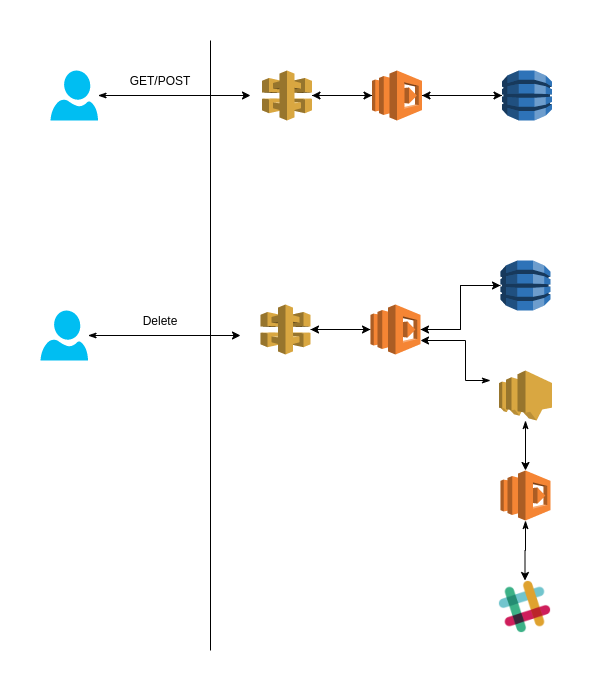

# aws-apigw-lambda-dynamodb-typescript-demo
##################################################################################

[][Architecture]

    Create aws profile "sandbox"
    Load aws profile "sandbox"
    export AWS_PROFILE=sandbox

   
   # Validate templates
   
    cd cloudformation
   
    aws --profile sandbox cloudformation validate-template --template-body file://iam.yaml
   
    aws --profile sandbox cloudformation validate-template --template-body file://dynamodb.yaml
   
   # npm install
    npm install --prod
   
   # Create IAM Roles
    aws --profile sandbox cloudformation create-stack --stack-name MySkillsDemoIAMRoles --template-body file://iam.yaml --capabilities CAPABILITY_NAMED_IAM
   # Create Dynamo DB Table
    aws --profile sandbox cloudformation create-stack --stack-name MySkillsDemoPrerequisites --template-body file://dynamodb.yaml --capabilities CAPABILITY_NAMED_IAM
   
  # Add Data to DB table in below format
  
    {
      "SensorId": "5678",
      "Timestamp": "2020-02-19T22:55:43.734Z",
      "Payload": {
        "Temperature": "20",
        "Timestamp": "2020-02-19T22:22:18.682Z"
      },
      "Topic": "Temperature"
    }
    
   	
    ** Note :: **
    Payload is a Map of Temperature (String) and Timestamp (String)
    SensorIdString, TimestampString, TopicString are string data type
 
 
  # Running Tests
  
     npm run build
  
  # Deploy Stack
   
      npm run deploy  
      
  # Destroy Stack
   
      npm run destroy
 
# Security
  
     1) API can be secured by API key which is a pretty loose way of authenticating as the api key is sent to client/browser from where its easily retrievable.
     2) Add a cognito user pool authorizer and map cognito pool with AD through SAML federation
        Or add a custom auth lambda and write logic to authenticate
        Or use Developer authenticated identities
     3) APIs can be further guarded by allowing traffic from certain IP CIDRs i.e. IPs of WAF 
